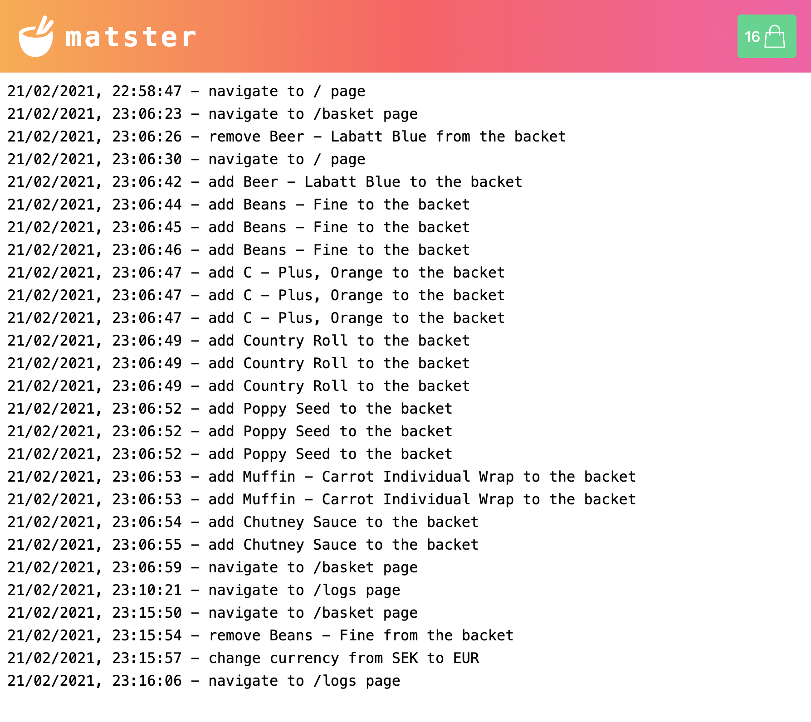

# `Matster`

Online food store. All goods can be sorted by name or price. By default, all goods prices are displayed in USD but can be converted to EUR or SEK by the latest rate of exchange. All goods can be added to the basket page - /basket. All user's navigation is recorded to the logs page - /logs.

Deployed to Heroku: https://matster.herokuapp.com. Deployment to Heroku is triggered each time a new commit is pushed to the main branch. 

## Technologies and libraries used: 

 - Server - [Node](https://nodejs.org), [Express](https://expressjs.com)
 - Data is stored on server filesystem in JSON files
 - Client Framework - [React](https://reactjs.org), [Redux](https://redux.js.org)
 - Styles - [Tailwind CSS](https://tailwindcss.com)
 - 3rd party API used - [Exchange Rate](https://exchangeratesapi.io)

## Architecture: 

## Implementation specifics: 
- Logs are stored in the filesystem and the file size isn’t limited.
- One image used for all goods.
- User management is out of scope, the application works in “single user mode”.
- Payment and orders are not implemented.

## Planned Improvements:
- Pagination.
- Limit logs file size.

## Main interaction scenarios as GIFs:

## Screenshots:

### Desktop (macOS, Chrome):

  
  

  
   
  

### Mobile (iOS, Chrome):

  
   

